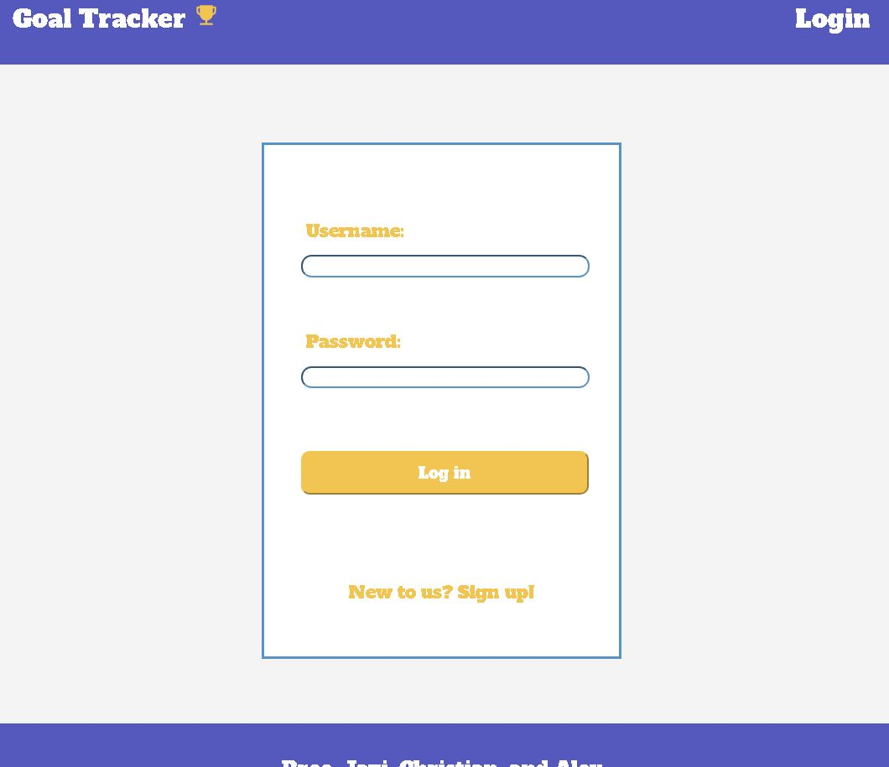
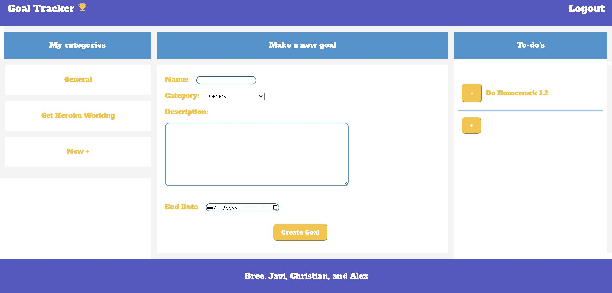
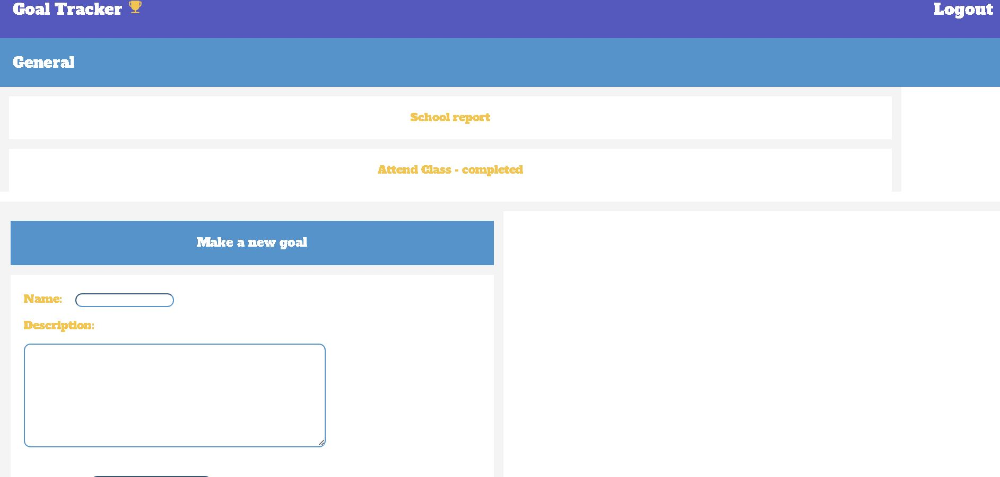
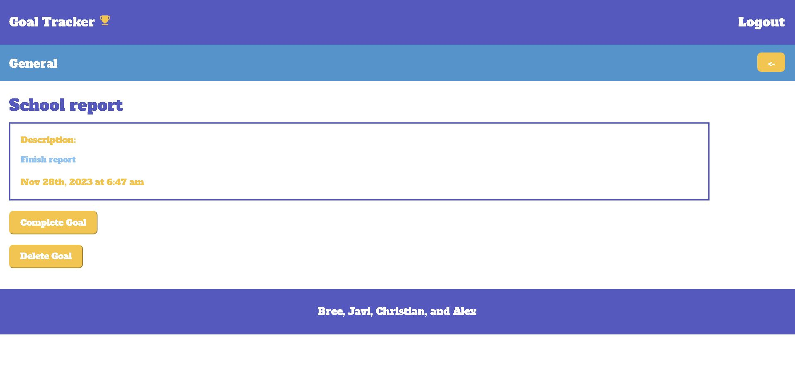

# Project-Three

## Description

We made a goal tracker app, and the main functionality of this app is to help users make new goals, set an end date for that goal, as well as categorize the goals so it can be organized. There is also a todos section, which don’t have an end date. These todos can be added or deleted at any time and can help you keep track of any general tasks that need to get done.

## Usage

Here is the link to our [deployed app](https://p3-goal-tracker-a21a36febf84.herokuapp.com/).

To use this app, first you must create an account or login if you already have an account. 

Once you login, you will be brought to the home page of the app, which shows your categories, create a new goal section, and the to-do's section. 

How you use the app can vary depending on how you prefer to organize it! You can create a new category first if you like, and then create new goals for that category.

You can also create a new goal from the homepage and assign it a category there. The to-do's section does stay on the homepage, and you can quickly add or remove your to-do's there.

You can delete categories and delete goals, or mark them as completed so you can see what you've been able to accomplish! 

